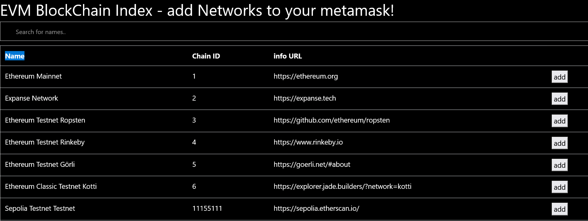

# blockrouter

Move effortlessly within the Etherium Ecosystem.
Metamask is required as a browser extension.
***********************************************************************************************************

***********************************************************************************************************
To add side chains to metamask visit
live demo at ; https://blockrouter.vercel.app
choose the chain you want to add and click the 'ADD' button.
***********************************************************************************************************
*  Web3 enabled - auto detects Metamask wallet.
*  Add sidechains to Metamask at the click of a button.
*  Massive selection of chains.
*  Quick and simple , no configuration.
*  Once you have added the new chain , just select it in metamask to switch .
***********************************************************************************************************  
# Currently supported

* Ethereum Mainnet	1	https://ethereum.org	
* Expanse Network	2	https://expanse.tech	
* Ethereum Testnet Ropsten	3	https://github.com/ethereum/ropsten	
* Ethereum Testnet Rinkeby	4	https://www.rinkeby.io	
* Ethereum Testnet Görli	5	https://goerli.net/#about	
* Ethereum Classic Testnet Kotti	6	https://explorer.jade.builders/?network=kotti	
* Sepolia Testnet Testnet	11155111	https://sepolia.etherscan.io/	
* ThaiChain	7	https://thaichain.io	
* Ubiq	8	https://ubiqsmart.com	
* Ubiq Network Testnet	9	https://ethersocial.org	
* Optimistic Ethereum	10	https://optimism.io	
* Metadium Mainnet	11	https://metadium.com	
* Metadium Testnet	12	https://metadium.com	
* Diode Testnet Staging	13	https://diode.io/staging	
* Flare Mainnet	14	https://flare.xyz	
* Diode Prenet	15	https://diode.io/prenet	
* Flare Testnet Coston	16	https://github.com/flare-eng/coston	
* ThaiChain 2.0 ThaiFi	17	https://exp.thaifi.com	
* ThunderCore Testnet	18	https://thundercore.com	
* Songbird Canary-Network	19	https://flare.xyz	
* ELA-ETH-Sidechain Mainnet	20	https://www.elastos.org/	
* ELA-ETH-Sidechain Testnet	21	https://elaeth.io/	
* ELA-DID-Sidechain Mainnet	22	https://www.elastos.org/	
* ELA-DID-Sidechain Testnet	23	https://elaeth.io/	
* RSK Mainnet	30	https://rsk.co	
* RSK Testnet	31	https://rsk.co	
* GoodData Testnet	32	https://www.goodata.org	
* GoodData Mainnet	33	https://www.goodata.org	
* TBWG Chain	35	https://tbwg.io	
* Valorbit	38	https://valorbit.com	
* Telos EVM Mainnet	40	https://telos.net	
* Telos EVM Testnet	41	https://telos.net	
* Ethereum Testnet Kovan	42	https://kovan-testnet.github.io/website	
* Darwinia Pangolin Testnet	43	https://darwinia.network/	
* Darwinia Crab Network	44	https://crab.network/	
* XinFin Network Mainnet	50	https://xinfin.org	
* XinFin Apothem Testnet	51	https://xinfin.org	
* CoinEx Smart Chain Mainnet	52	http://www.coinex.org/	
* CoinEx Smart Chain Testnet	53	http://www.coinex.org/	
* Binance Smart Chain Mainnet	56	https://www.binance.org	
* Syscoin Mainnet	57	https://www.syscoin.org	
* Ontology Mainnet	58	https://ont.io/	
* EOS Mainnet	59	https://eoscommunity.org/	
* GoChain	60	https://gochain.io	
* Ethereum Classic Mainnet	61	https://ethereumclassic.org	
* Ethereum Classic Testnet Morden	62	https://ethereumclassic.org	
* Ethereum Classic Testnet Mordor	63	https://github.com/eth-classic/mordor/	
* Ellaism	64	https://ellaism.org	
* OKExChain Testnet	65	https://www.okex.com/okexchain	
* OKExChain Mainnet	66	https://www.okex.com/okexchain	
* DBChain Testnet	67	http://test.dbmbp.com	
* SoterOne Mainnet	68	https://www.soterone.com	
* Optimistic Ethereum Testnet Kovan	69	https://optimism.io	
* Mix	76	https://mix-blockchain.org	
* POA Network Sokol	77	https://poa.network	
* PrimusChain mainnet	78	https://primusmoney.com	
* GeneChain	80	https://scan.genechain.io/	
* Meter Mainnet	82	https://www.meter.io	
* GateChain Testnet	85	https://www.gatechain.io	
* GateChain Mainnet	86	https://www.gatechain.io	
* TomoChain	88	https://tomocoin.io	
* CryptoKylin Testnet	95	https://www.cryptokylin.io/	
* Binance Smart Chain Testnet	97	https://testnet.binance.org/	
* POA Network Core	99	https://poa.network	
xDAI Chain	100	https://forum.poa.network/c/xdai-chain	
EtherInc	101	https://einc.io	
Web3Games Testnet	102	https://web3games.org/	
ThunderCore Mainnet	108	https://thundercore.com	
Proton Testnet	110	https://protonchain.com	
EtherLite Chain	111	https://etherlite.org	
Fuse Mainnet	122	https://fuse.io/	
Decentralized Web Mainnet	124	https://decentralized-web.tech/dw_chain.php	
Factory 127 Mainnet	127	https://www.factory127.com	
Huobi ECO Chain Mainnet	128	https://www.hecochain.com	
Matic(Polygon) Mainnet	137	https://matic.network/	
DAX CHAIN	142	https://prodax.io/	
Lightstreams Testnet	162	https://explorer.sirius.lightstreams.io	
Lightstreams Mainnet	163	https://explorer.lightstreams.io	
HOO Smart Chain Testnet	170	https://www.hoosmartchain.com	
Latam-Blockchain Resil Testnet	172	https://latam-blockchain.com	
Arbitrum on xDai	200	https://xdaichain.com	
Freight Trust Network	211	https://freighttrust.com	
Energy Web Chain	246	https://energyweb.org	
Fantom Opera	250	https://fantom.foundation	
Huobi ECO Chain Testnet	256	https://testnet.hecoinfo.com	
High Performance Blockchain	269	https://hpbscan.org/	
KCC Mainnet	321	https://kcc.io	
KCC Testnet	322	https://scan-testnet.kcc.network	
Theta Mainnet	361	https://www.thetatoken.org/	
Theta Sapphire Testnet	363	https://www.thetatoken.org/	
Theta Amber Testnet	364	https://www.thetatoken.org/	
Theta Testnet	365	https://www.thetatoken.org/	
Lisinski	385	https://lisinski.online	
Optimistic Ethereum Testnet Goerli	420	https://optimism.io	
Rupaya	499	https://www.rupx.io	
Tao Network	558	https://tao.network	
Acala Mandala Testnet	595	https://acala.network	
Karura Network	686	https://karura.network	
Factory 127 Testnet	721	https://www.factory127.com	
cheapETH	777	https://cheapeth.org/	
Acala Network	787	https://acala.network	
Haic	803	https://www.haichain.io/	
Callisto Mainnet	820	https://callisto.network	
Callisto Testnet	821	https://callisto.network	
Wanchain	888	https://www.wanscan.org	
Nepal Blockchain Network	977	https://nepalblockchain.network	
Wanchain Testnet	999	https://testnet.wanscan.org	
Klaytn Testnet Baobab	1001	https://www.klaytn.com/	
Newton Testnet	1007	https://www.newtonproject.org/	
Evrice Network	1010	https://evrice.com	
Newton	1012	https://www.newtonproject.org/	
Sakura	1022	https://clover.finance/sakura	
Clover Testnet	1023	https://clover.finance	
Clover Mainnet	1024	https://clover.finance	
MathChain	1139	https://mathchain.org	
MathChain Testnet	1140	https://mathchain.org	
Moonbeam	1284	https://moonbeam.network/networks/moonbeam/	
Moonriver	1285	https://moonbeam.network/networks/moonriver/	
Moonrock	1286		
Moonbase Alpha	1287	https://docs.moonbeam.network/networks/testnet/	
Moonshadow	1288	https://docs.moonbeam.network/networks/overview/	
Catecoin Chain Mainnet	1618	https://catechain.com	
Atheios	1620	https://atheios.com	
Teslafunds	1856	https://teslafunds.io	
EtherGem	1987	https://egem.io	
420coin	2020	https://420integrated.com	
Edgeware Mainnet	2021	http://edgewa.re	
Beresheet Testnet	2022	http://edgewa.re	
Kortho Mainnet	2559	https://www.kortho.io/	
IoTeX Network Mainnet	4689	https://iotex.io	
IoTeX Network Testnet	4690	https://iotex.io	
EraSwap Mainnet	5197	https://eraswap.info/	
Syscoin Tanenbaum Testnet	5700	https://syscoin.org	
Ontology Testnet	5851	https://ont.io/	
Wegochain Rubidium Mainnet	5869	http://wegochain.io	
MDGL Testnet	8029	https://mdgl.io	
GeneChain Adenine Testnet	8080	https://scan-testnet.genechain.io/	
Klaytn Mainnet Cypress	8217	https://www.klaytn.com/	
KorthoTest	8285	https://www.kortho.io/	
TOOL Global Mainnet	8723	https://ibdt.io	
TOOL Global Testnet	8724	https://testnet-explorer.wolot.io	
bloxberg	8995	https://bloxberg.org	
Smart Bitcoin Cash	10000	https://smartbch.org/	
Smart Bitcoin Cash Testnet	10001	http://smartbch.org/	
Blockchain Genesis Mainnet	10101	https://www.xixoio.com/	
MetaDot Mainnet	16000	https://metadot.network	
MetaDot Testnet	16001	https://metadot.network	
Webchain	24484	https://webchain.network	
MintMe.com Coin	24734	https://www.mintme.com	
Ethersocial Network	31102	https://ethersocial.org	
GoChain Testnet	31337	https://gochain.io	
Fusion Mainnet	32659	https://www.fusion.org/	
Energi Mainnet	39797	https://www.energi.world/	
pegglecoin	42069	https://teampeggle.com	
Arbitrum One	42161	https://arbitrum.io	
Celo Mainnet	42220	https://docs.celo.org/	
Athereum	43110	https://athereum.ava.network	
Avalanche Fuji Testnet	43113	https://cchain.explorer.avax-test.network	
Avalanche Mainnet	43114	https://cchain.explorer.avax.network/	
Celo Alfajores Testnet	44787	https://docs.celo.org/	
Energi Testnet	49797	https://www.energi.world/	
Celo Baklava Testnet	62320	https://docs.celo.org/	
Polyjuice Testnet	71393	https://github.com/nervosnetwork/godwoken	
Energy Web Volta Testnet	73799	https://energyweb.org	
Firenze test network	78110	https://primusmoney.com	
Matic(Polygon) Testnet Mumbai	80001	https://matic.network/	
QuarkChain Mainnet Root	100000	https://www.quarkchain.io/	
QuarkChain Mainnet Shard 0	100001	https://www.quarkchain.io/	
QuarkChain Mainnet Shard 1	100002	https://www.quarkchain.io/	
QuarkChain Mainnet Shard 2	100003	https://www.quarkchain.io/	
QuarkChain Mainnet Shard 3	100004	https://www.quarkchain.io/	
QuarkChain Mainnet Shard 4	100005	https://www.quarkchain.io/	
QuarkChain Mainnet Shard 5	100006	https://www.quarkchain.io/	
QuarkChain Mainnet Shard 6	100007	https://www.quarkchain.io/	
QuarkChain Mainnet Shard 7	100008	https://www.quarkchain.io/	
QuarkChain Devnet Root	110000	https://www.quarkchain.io/	
QuarkChain Devnet Shard 0	110001	https://www.quarkchain.io/	
QuarkChain Devnet Shard 1	110002	https://www.quarkchain.io/	
QuarkChain Devnet Shard 2	110003	https://www.quarkchain.io/	
QuarkChain Devnet Shard 3	110004	https://www.quarkchain.io/	
QuarkChain Devnet Shard 4	110005	https://www.quarkchain.io/	
QuarkChain Devnet Shard 5	110006	https://www.quarkchain.io/	
QuarkChain Devnet Shard 6	110007	https://www.quarkchain.io/	
QuarkChain Devnet Shard 7	110008	https://www.quarkchain.io/	
Akroma	200625	https://akroma.io	
ARTIS sigma1	246529	https://artis.eco	
ARTIS Testnet tau1	246785	https://artis.network	
Polis Testnet	333888	https://polis.tech	
Polis Mainnet	333999	https://polis.tech	
Arbitrum Testnet Rinkeby	421611	https://arbitrum.io	
Ether-1	1313114	https://ether1.org	
Xerom	1313500	https://xerom.org	
Musicoin	7762959	https://musicoin.tw	
PepChain Churchill	13371337	https://pepchain.io	
IOLite	18289463	https://iolite.io	
quarkblockchain	20181205	https://quarkblockchain.org/	
Auxilium Network Mainnet	28945486	https://auxilium.global	
Joys Digital Mainnet	35855456	https://joys.digital	
Aquachain	61717561	https://aquachain.github.io	
Joys Digital TestNet	99415706	https://joys.digital	
OneLedger Nexus Mainnet	311752642	https://oneledger.io	
IPOS Network	1122334455	https://iposlab.com	
Aurora MainNet	1313161554	https://aurora.dev	
Aurora TestNet	1313161555	https://aurora.dev	
Aurora BetaNet	1313161556	https://aurora.dev	
Harmony Mainnet Shard 0	1666600000	https://www.harmony.one/	
Harmony Mainnet Shard 1	1666600001	https://www.harmony.one/	
Harmony Mainnet Shard 2	1666600002	https://www.harmony.one/	
Harmony Mainnet Shard 3	1666600003	https://www.harmony.one/	
Harmony Testnet Shard 0	1666700000	https://www.harmony.one/	
Harmony Testnet Shard 1	1666700001	https://www.harmony.one/	
Harmony Testnet Shard 2	1666700002	https://www.harmony.one/	
Harmony Testnet Shard 3	1666700003	https://www.harmony.one/	
Pirl	3125659152	https://pirl.io	
OneLedger Frankenstein Testnet	4216137055	https://oneledger.io	
Palm Testnet	11297108099	https://palm.io	
Palm Mainnet	11297108109	https://palm.io
